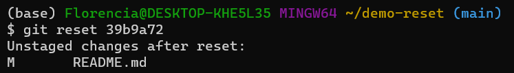
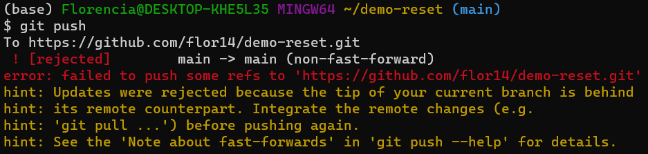
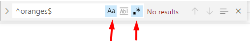
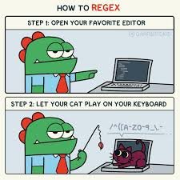
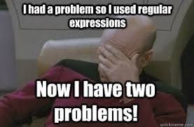
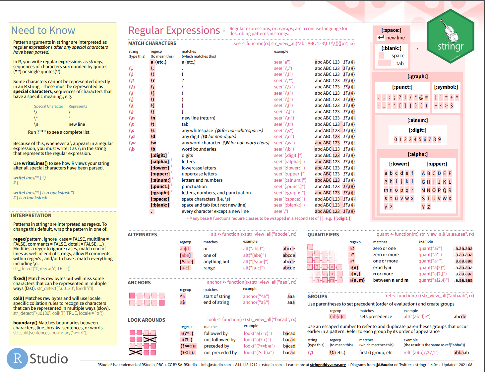

```{r setup, include=FALSE}
options(htmltools.dir.version = FALSE)
```

```{r xaringan-themer, include=FALSE, warning=FALSE}
library(xaringanthemer)
library(xaringanExtra)
library(tidyverse)
library(knitr)
library(nomnoml)
library(countdown)
xaringanExtra::use_logo(
  image_url = "https://raw.githubusercontent.com/rstudio/hex-stickers/master/PNG/xaringan.png"
)
xaringanExtra::use_panelset()
xaringanExtra::use_broadcast()
xaringanExtra::use_share_again()
xaringanExtra::style_share_again(share_buttons = c("twitter", "linkedin"))
xaringanExtra::use_tachyons()
xaringanExtra::use_fit_screen()
xaringanExtra::use_tile_view() # O
style_mono_accent(
  base_color = "#0dc96f",
  background_color = "#ffffff",
  inverse_background_color = "#3298cb",
  header_color = "#022044",
  inverse_header_color = "#ffffff", 
  inverse_text_color = "#ffffff",
  code_inline_color = "#179c55",
  link_color= "#0000FF",
  text_font_size = "25px",
  header_font_google = google_font("Poppins", "Regular", "400"),
  text_font_google   = google_font("Darker Grotesque", "500"),
  code_font_google   = google_font("Fira Mono"),
  )

```

```{r metathis, warning=FALSE, echo=FALSE}
# library(metathis)
# meta() %>%
#   meta_name("github-repo" = "flor14/rladies-jujuy") %>% 
#   meta_social(
#     title = "Meetup R-Ladies Jujuy",
#     description = paste(
#       "Mi próximo artículo científico con R:", 
#       "Compendios de Investigación, Reproducibilidad e",
#       "Interactividad en las publicaciones académicas"
#     ),
#     url = "https://flor14.github.io/rladies-jujuy/presentacion.html?panelset=licencia#1",
#     image = "https://res.cloudinary.com/flor/image/upload/v1608248822/jujuy-colores_frmvax.jpg",
#     image_alt = paste(
#       "Charla para el capítulo de R-Ladies de Jujuy, Argentina.",
#       "Diciembre de 2020"
#       ),
#     og_type = "website",
#     og_author = "Florencia D'Andrea",
#     twitter_card_type = "summary_large_image",
#     twitter_creator = "@cantoflor_87",
#     twitter_site = "@cantoflor_87"
#   )
```


class: middle, center

```{r hex, fig.align='center', echo = FALSE, out.width=150} 
    knitr::include_graphics("img/hex.png")
```


---


class: bottom

.bg-washed-blue.b--dark-blue.ba.bw2.br3.shadow-5.ph4.mt5[
### DSCI 521 - Lecture 4
### **Time travelling with git reset, and pattern matching with regex**

 .large[#### Computing Platforms for Data Science - UBC MDS 2021/22
]]


---

## Lecture 4

1. Use git reset to move a branch back in the commit history.

--

2. Precisely match specific sequences of text strings using regex.


---

class: center, middle, inverse

# TIME TRAVELLING
### with _git reset_

---

### Refer to a commit 

Commit ID or SHA-1 hash

```bash
commit b22d6421363c7b82e2b88b0b5f1f25edca703303

commit b22d
```

--

## `git log --oneline` 

```{r git_log, fig.align='center', echo = FALSE,out.width=700} 
knitr::include_graphics("img/gitlogid.png")
```


---

### Move to a previous commit

```bash
git reset <commit id>
```

**(1) This command changes the commit history**

.footnote[[Git Docs - Reset, restore and revert](https://git-scm.com/docs/git)]

---

### What happened to the changes? 

**(2) You can edit the changes**

We could now make any modification we wish and then commit again 

```{r obj4, fig.align='center', echo = FALSE,out.width=700} 

```


---

### What if we want to discard the changes instead of moving them to the working area?

```bash
git reset --hard <sha>
```
It will not show us any message, since the changes are not unstaged, they are **discarded**.

---

class: middle, center, inverse

## SYNCING WITH A REMOTE AFTER RESETTING


---

### Git push

##### Git will refuse to push changes when the remote is ahead of the local branch.


```{r push, fig.align='center', echo = FALSE,out.width=700} 

```

To override this warning and force git to push to the remote
we can use the **-f/--force** flag.
---

## Danger Zone

```bash
git push -f/--force 
```

--
- Should never do this on the `main` branch of a repository that you **share with collaborators** unless you have all discussed this

--

- Everyone else who is using this repository are now **out of sync** with the `main` branch, since you have reset master to a previous state

--

**Safer**
: If you are working alone and you know what you are doing


---
class: middle, center, inverse
 
# INTRODUCTION TO 
# REGULAR EXPRESIONS 
### regex

---

# .*

### A regular expression, often abbreviated to **regex**, is a method of using a sequence of characters to define a search to match strings, i.e. “find and replace”-like operations. 


.footnote[[Library Carpentries](https://librarycarpentry.org/lc-data-intro/01-regular-expressions/)]
---

## JupyterLab and VS Code have built in regex functionality 
(Ctrl + F)


#### VSCode


```{r regex, fig.align='center', echo = FALSE,out.width=500} 

```
#### JupyterLab 
```{r regexjl, fig.align='center', echo = FALSE,out.width=500} 
knitr::include_graphics("img/jupyterLab.png")
```

---

## The square brackets: []

If you want to specify the set of possible characters you can use square brackets []


`[Aa]`pple 


--


#### - Find all the pairs of vowels in the fruit list.


.footnote[[Answers in Lecture4](https://pages.github.ubc.ca/mds-2021-22/DSCI_521_platforms-dsci_students/README.html)]

---

## Ranges within []

You can also define ranges when using brackets. 

--

`[A-Z]`: will match any upper case letter  
`[a-z]`: will match any lower case letter  
`[0-9]`: will match any digit  
`[0-5]`: will match any digit between 0 and 5  

--

.footnote[[Order based in ASCII](https://en.wikipedia.org/wiki/ASCII#Printable_characters)]

---

## Ranges within []

You can use square brackets starting with a caret. 

`[^A-Z]`: will match anything that is not an upper case letter  
`[^0-9]`: will match anything that is not a digit


--

.footnote[Note that the caret needs to be inside the bracket, if it is outside it will match the beginning of a line as described under the "Anchors" section below.]

---

## Ranges within []

You can combine ranges: `[A-Za-z]`.   

#### - What is the difference between writing `[A-Za-z]` and `[A-z]`?

--

```
!"#$%&'()*+,-./0123456789:;<=>?@ABCDEFGHIJKLMNOPQRSTUVWXYZ[\]^_`
abcdefghijklmnopqrstuvwxyz{|}~ 
```
> These ranges are ordered based on ASCI codes where every character is represented by a number.  
> The first character in the list is  (space) and the last is ~ (tilde). 


 `[A-z]` will also match the characters `[/]^_`, as you can see in the list above.  

---

## Special matching characters

**.** can be used to match any character in the list above

--

To match a **.**  prefacing it with a backslash `\.`

`\w`, which matches any character that normally occurs   
inside a word (`[A-Za-z0-9_]`)


---

## Anchors

- The **^** (caret) outside the brackets means beginning of line.
- The dollar sign **$** means end of line

Another useful anchor is `\b`, which matches end of word.

--

> Start with power (^) and end with money ($)   
> _Jenny Bryan_


---


```{r regexdino, fig.align='center', echo = FALSE,out.width=500} 

```


---


## Repetitions

To match multiple of the same character, you can either repeat it or use the following syntax:

`{n}`: exactly n occurrences  
`{n,}`: at least n occurrences  
`{0,m}`: at most m occurrences  
`{n,m}`: between n and m (inclusive) occurrences  

--

#### - Find the fruits with names between 10 and 12 characters.
#### - Find the lines with no more than 4 letters

---


## Special repetition characters

There are some shortcuts for the most common repetitions:  
  
`?`: means 0 or 1 time ({0,1})   
`*`: means 0 or more time ({0,})   
`+`: means 1 or more time ({1,})  

--

na**?** will match _n_ or _na_.

na***** will match all of _n_, _na_, _naaa_, etc.

na**+** will match _na_ or _naaaa_, for example, but not _n_.


---

## Some practice

- Match any characters between two _.
- Find all the words that contain at least two consecutive vowels.
- This is a bit harder derives from all previous sections: Match entire words that end in _.


.footnote[[Answers in Lecture4](https://pages.github.ubc.ca/mds-2021-22/DSCI_521_platforms-dsci_students/README.html)]


---

class: middle, center

```{r 2problems, fig.align='center', echo = FALSE,out.width=700} 

```

---

## Additional exercises

.bg-washed-blue.b--dark-blue.ba.bw2.br3.shadow-5.ph4.mt5[

- https://regexr.com/    
- https://regex101.com/
   
]
---


## Additional exercises

.bg-washed-blue.b--dark-blue.ba.bw2.br3.shadow-5.ph4.mt5[

* Interactive tutorials and practice sessions at https://regexone.com/ that correspond to the topics we have covered during class.
    
* The Library Carpentry organization has many regex exercises in all sections of their regex course here https://librarycarpentry.org/lc-data-intro/ (you can just to do the exercises).

]

---

### Regex is often used in programming languages for matching patterns in strings

```{r regexrs, fig.align='center', echo = FALSE,out.width=600} 

```

.footnote[[String manipulation with stringr - RStudio Cheatsheets](https://www.rstudio.com/resources/cheatsheets/)]

---

class: inverse, middle, center


## Thank you!
