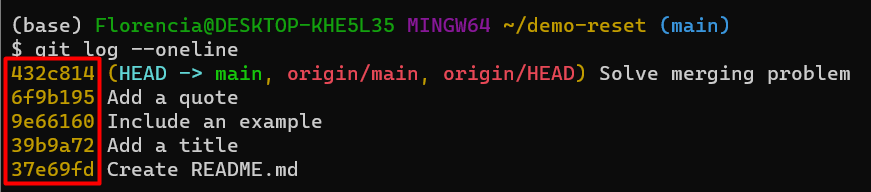

```{r setup, include=FALSE}
options(htmltools.dir.version = FALSE)
```

```{r xaringan-themer, include=FALSE, warning=FALSE}
library(xaringanthemer)
library(xaringanExtra)
library(tidyverse)
library(knitr)
library(nomnoml)
library(countdown)
xaringanExtra::use_logo(
  image_url = "https://raw.githubusercontent.com/rstudio/hex-stickers/master/PNG/xaringan.png"
)
xaringanExtra::use_panelset()
xaringanExtra::use_broadcast()
xaringanExtra::use_share_again()
xaringanExtra::style_share_again(share_buttons = c("twitter", "linkedin"))
xaringanExtra::use_tachyons()
xaringanExtra::use_fit_screen()
xaringanExtra::use_tile_view() # O
style_mono_accent(
  base_color = "#0dc96f",
  background_color = "#ffffff",
  inverse_background_color = "#3298cb",
  header_color = "#022044",
  inverse_header_color = "#ffffff", 
  inverse_text_color = "#ffffff",
  code_inline_color = "#179c55",
  link_color= "#0000FF",
  text_font_size = "25px",
  header_font_google = google_font("Poppins", "Regular", "400"),
  text_font_google   = google_font("Darker Grotesque", "500"),
  code_font_google   = google_font("Fira Mono"),
  )

```

```{r metathis, warning=FALSE, echo=FALSE}
# library(metathis)
# meta() %>%
#   meta_name("github-repo" = "flor14/rladies-jujuy") %>% 
#   meta_social(
#     title = "Meetup R-Ladies Jujuy",
#     description = paste(
#       "Mi próximo artículo científico con R:", 
#       "Compendios de Investigación, Reproducibilidad e",
#       "Interactividad en las publicaciones académicas"
#     ),
#     url = "https://flor14.github.io/rladies-jujuy/presentacion.html?panelset=licencia#1",
#     image = "https://res.cloudinary.com/flor/image/upload/v1608248822/jujuy-colores_frmvax.jpg",
#     image_alt = paste(
#       "Charla para el capítulo de R-Ladies de Jujuy, Argentina.",
#       "Diciembre de 2020"
#       ),
#     og_type = "website",
#     og_author = "Florencia D'Andrea",
#     twitter_card_type = "summary_large_image",
#     twitter_creator = "@cantoflor_87",
#     twitter_site = "@cantoflor_87"
#   )
```


class: middle, center

```{r hex, fig.align='center', echo = FALSE, out.width=150} 
    knitr::include_graphics("img/hex.png")
```


---


class: bottom

.bg-washed-blue.b--dark-blue.ba.bw2.br3.shadow-5.ph4.mt5[
### DSCI 521 - Lecture 5
### **RStudio and R Markdown**

 .large[#### Computing Platforms for Data Science - UBC MDS 2021/22
]]


---

## Lecture 5


1. RStudio

--

2. Edit and run R scripts within RStudio

--

3. Create an **RStudio project**

--

4. Compose **RMarkdown** documents

---

class: center, middle, inverse

# RSTUDIO


---

### Interactive Development Environment (IDE)

--

## The RStudio interface 

```{r git_log, fig.align='center', echo = FALSE,out.width=700} 

```


---

### R Scripts

To create a new R Script, navigate to `New File -> R Script`. 


```R
x <- 5
y <- x + 3
print(paste0("y = ", y))
```
---

### Run the script

You can press the "Source" button to run the entire script (running a script is often referred to as "sourcing" it, hence the name). As you can see, the Console shows you what line it ran in order to source the script (you could also type this out yourself), and then displayed any output from the script in the end. You can run just part of a script by pressing the "Run" button, which runs any highlighted lines (the current line by default, the keyboard shortcut is Ctrl + Enter).


---

### What happened to the changes? 

If a plot is generate from the executed code, it will show up in the "Plots" tab in the bottom left panel. You can try it by adding the following line to the script and clicking to run it (it uses a built-in data set called "cars"):


```{r obj4, fig.align='center', echo = TRUE,out.width=700} 
plot(cars)
```


---

class: middle, center, inverse

## Editing RStudio settings to not save workspace data


---

## save workspace data

In general, we NEVER want to save our workspace (or load a previous one). We can avoid accidentally doing this through turning it off in the RStudio global options in the Tools menu.

---

## Where we are?

Different from JupyterLab, when you open RStudio you open a .R or .Rmd file the RStudio, the current working directory is not neccesarily the project working directory, or the directory of the file you opened.

EVERY SESSION you need to tell RStudio where you are working. Especially if you are loading other files outside of your .R or .Rmd file


So, where are you when you open RStudio? You can find out one of two ways:

1. type getwd() in the console

2. In the files pane, click the cog/More button and then click "Go To Working Directory"


---

## Setting the working directory

You can set the working directory using the following 3 ways:

1. Use an RStudio project (more on this below)

2. In the files pane, navigate the file structure to where you want the working directory to be. Then click the cog/More button and then click "Set As Working Directory"

3. In the Session menu, click Set Working Directory and then Choose Directory. Navigate the opened file browser to choose the directory.

4. Type setwd("PATH") in the console (should be used with care though - see Jenny's article about it.)

---
class: middle, center, inverse
 
# RStudio projects

---

## An RStudio project is essentially a directory containing a special file: *.Rproj, which holds metadata for R about this project. RProjects set the working directory by default to be the root of the project and we recommend using it together with the here() package, which can easily create paths relative to root project dir:

```{r}

#install.packages("here")
#library(here)

# If you data is in project_root/files/data/
# this will make sure that anyone using your project
# will get the correct path
#here("files", "data", "iris.csv")


```


---

## Creating RStudio Projects

You can either create an empty RStudio project, or clone an existing GitHub repo, which also allows you to use the RStudio interface to control Git.

Start by making a GitHub repo
Copy the URL needed to clone that repo from GitHub
Then select File > New Project > Version Control > Git and fill in.
Now you can use RStudio as a Git client via the colorful icon in the toolbar of the edit panel. This includes adding parts of a document do the staging area, committing, pushing, pulling, and more. Using terminal Git will still be more reliable, since it is available anywhere Git is installed, but feel free to use the RStudio (or VS Code) interfaces as a complement.


---

class: middle, center, inverse

# R Markdown and R Notebooks

---

R Markdown is a "flavor" of Markdown that allows you to run R code in addition to supporting all the Markdown syntax that you have already learned. R Markdown documents (.Rmd) are most commonly run via R Notebooks which work similarly to Jupyter notebooks in the sense that you can interleave writing code, formatted narrative text, and view output all in the same document. These are both examples of what it called "literate programming" where the goal is to mix code and paragraph text seamlessly.

Let's see an example of this by creating a new R Notebook via File -> New -> R Notebook. As you can see, there is a default template for Notebooks, which include useful info on how to use them. We can see the keyboard shortcuts for running and inserting cells, and when we execute the plot code the plot shows up inside the notebook rather than in the side panel as when we ran the same line from within the script script.

---

## Text and rendering R Markdown documents
In a R Markdown document any line of text not in a code chunk (like this line of text) will be formatted using Markdown. Similar to JupyterLab, you can also use HTML and LaTeX here to do more advanced formatting. Unlike JupyterLab, you do not get to see these Markdown sections rendered on their own. To see this text rendered, you need to render the whole document. You can do that clicking the "Knit" or "Preview" button on the top. The difference between these two is that "Preview" creates a HTML version of your document as it looks right now, whereas "Knit" first restarts the R session and runs through the entire document from the beginning to make sure it will work when you send it to someone else.


---


#### A helpful hint for successfully working with R Markdown documents
Given that you need to render the entire document to see your Markdown and LaTeX rendered, it is important to "knit" often as you make changes. If you make an error in a LaTeX equation for example, it will stop the knitting/rendering process and you will not get to see the rendered document. So by knitting/rendering often you will know where the last changes you made are and then will be able to easily identify and fix your errors.
---

## 1.2. Running, editing and creating code chunks
Just like Jupyter notebooks, R Markdown has code cells, although they're more commonly referred to as code "chunks" or "blocks". These are based off fenced Markdown code blocks and always start and end with 3 backticks (```), just like in Markdown. Unique to R Markdown is that the leading three backticks are followed by curly braces containing the language engine you want to run, which for r looks like this {r}. Additional metadata can be included, for example a name to reference the code chunk:

```{r my first code chunk}
x <- 5
x
```
There are other language engines that can be used in RMarkdown, you can learn more about that here.

All code cells are run when you knit/render the entire document (like pressing "Run all" in JupyterLab). By default, the code in the chunk and the code output will be included in your rendered document. You can also run the code by clicking the green play button on the right-hand side of the code chunk

--

## 1.3. Naming code chunks and R Markdown document sections
When you include Markdown headers (using the # symbol) R Studio automatically creates a pop-up-like menu for you to use to navigate the document, which you can access by clicking the bar below this editor panel. It looks like:

By clicking on any of the headings in the pop-up-like menu, RStudio will navigate you to that section of the R Markdown document. Try clicking on one to see how it works.

In addition to Markdown headings, RStudio also keeps track of code chunks in that menu. By default RStudio names the chunks by their position (e.g. Chunk 1, Chunk 2, etc). But in reality those names are not that useful and it is more helpful to give code chunks meaningful names. For example, in the code chunk below where we use a for loop to sum the numbers from 1 to 10, we name the chunk "for loop sum".

```{r for loop sum}
# initialize sum to 0
loop_sum <- 0

# loop of a sequence from 1 to 10 and calculate the sum
for (i in seq(1:10)){
  loop_sum <- loop_sum + i
}

print(loop_sum)
```
Do not duplicate code chunk names, this will break the rendering of your document!

---

## Code snippets
As we started to type for above, the code completion popped up and the first entry said "snippet", what is that? A code snippet is a text macro, which means that you can type a short string of characters to insert a template or snippet of text by pressing TAB. You can see all the default snippets and define your own by going to Tools -> Global options -> Code -> Edit snippets. Snippets are available anywhere in RStudio, not just in R Markdown documents.


---

## 1.4. Code chunk options
There are many code chunk options that you can set. These options let you customize chunk behavior, including whether a chunk is evaluated, whether to include the output in the rendered document, etc. A short list of code chunk options is shown below, but you can find an extensive list starting on the second page of this document.

You can set the chunk options at either a global level (once set they will be applied to all code chunks in the .Rmd file) or locally for a specific chunk (these will override the global chunk options if they are contradictory).

Global options are usually set in one chunk at the top of the document and looks like this (this is a screenshot):

```{r setup2, include=FALSE, echo = FALSE}
knitr::opts_chunk$set(echo = FALSE)
```

---

Global chunk options are set by adding them as arguments to knitr::opts_chunk$set(...) (put them in place of ... and separate multiple options with a comma). The only global chunk options set in this document is echo = FALSE, which hides the code chunks and only shows the output, something that can be useful for non-technical reports.

Local chunk options are set by adding the options in the curly braces of a code chunk after the language engine and code chunk name. For example, to not display warnings in a single code chunk we would use the warning = FALSE code chunk as follows:

```{r correlation no warning, warning = FALSE}
# some R code that throws a warning
cor( c( 1 , 1 ), c( 2 , 3 ) )
```
---

## A few tips and tricks

R Markdown support inline evaluated code via the following syntax
  Adding 3 to 4 gives `r 4 + 3`.
  The value of `x` is currently `r x`.
Latex equations can be written the same way as in Jupyter notebooks and standard markdown documents.
- `$\alpha = 5$` for inline latex and `$$\alpha = 5$$` for a math block.
- When hovering over equations,
  R will display the rendered equation in a pop up.

---

## A few tips and tricks

R Markdown is built upon the Pandoc Markdown engine. This is useful to know since the Pandoc manual is a great exhaustive resource for looking up anything Markdown related.
One of the features made available thanks to Pandoc is support for citations and bibliographies.
Let's cite the R-package by typing citation() into the console, and copying the BibTex citation into a new document that we call rstudio-demo.bib 
and adding an identifier string (a key) before the first comma,
e.g.r-lang`.

---

## A few tips and tricks

Include the following field in the YAML metadata in the beginning of the document: bibliography: rstudio-demo.bib, then cite it somewhere in the text by adding [@r-lang]. The bibliography will be appended to the document, so it is advisable to add a heading saying # References at the very end.
When working with R Markdown (and code in general) be careful that you don't copy stylized quotation marks because these will not work. For example, this will throw an error:

a = “This string”
It should look like this instead:

a = "This string"
---

class: inverse, middle, center


## Thank you!
