```{r setup, include=FALSE}
options(htmltools.dir.version = FALSE)
```

```{r xaringan-themer, include=FALSE, warning=FALSE}
library(xaringanthemer)
library(xaringanExtra)
library(tidyverse)
library(knitr)
library(nomnoml)
library(countdown)
xaringanExtra::use_logo(
  image_url = "https://raw.githubusercontent.com/rstudio/hex-stickers/master/PNG/xaringan.png"
)
xaringanExtra::use_panelset()
xaringanExtra::use_broadcast()
xaringanExtra::use_share_again()
xaringanExtra::style_share_again(share_buttons = c("twitter", "linkedin"))
xaringanExtra::use_tachyons()
xaringanExtra::use_fit_screen()
xaringanExtra::use_tile_view() # O
style_mono_accent(
  base_color = "#0dc96f",
  background_color = "#ffffff",
  inverse_background_color = "#3298cb",
  header_color = "#022044",
  inverse_header_color = "#ffffff", 
  inverse_text_color = "#ffffff",
  code_inline_color = "#179c55",
  link_color= "#0000FF",
  text_font_size = "25px",
  header_font_google = google_font("Poppins", "Regular", "400"),
  text_font_google   = google_font("Darker Grotesque", "500"),
  code_font_google   = google_font("Fira Mono"),
  )

```

```{r metathis, warning=FALSE, echo=FALSE}
# library(metathis)
# meta() %>%
#   meta_name("github-repo" = "flor14/rladies-jujuy") %>% 
#   meta_social(
#     title = "Meetup R-Ladies Jujuy",
#     description = paste(
#       "Mi próximo artículo científico con R:", 
#       "Compendios de Investigación, Reproducibilidad e",
#       "Interactividad en las publicaciones académicas"
#     ),
#     url = "https://flor14.github.io/rladies-jujuy/presentacion.html?panelset=licencia#1",
#     image = "https://res.cloudinary.com/flor/image/upload/v1608248822/jujuy-colores_frmvax.jpg",
#     image_alt = paste(
#       "Charla para el capítulo de R-Ladies de Jujuy, Argentina.",
#       "Diciembre de 2020"
#       ),
#     og_type = "website",
#     og_author = "Florencia D'Andrea",
#     twitter_card_type = "summary_large_image",
#     twitter_creator = "@cantoflor_87",
#     twitter_site = "@cantoflor_87"
#   )
```


class: middle, center

```{r hex, fig.align='center', echo = FALSE, out.width=150} 
    knitr::include_graphics("img/hex.png")
```


---


class: bottom

.bg-washed-blue.b--dark-blue.ba.bw2.br3.shadow-5.ph4.mt5[
### DSCI 521 - Lecture 5
### **RStudio and R Markdown**

 .large[#### Computing Platforms for Data Science - UBC MDS 2021/22
]]


---

## Lecture 5


1. Know our way around the **RStudio** interface

--

2. Edit and run **R scripts** within RStudio

--

3. Create an **RStudio project**

--

4. Compose **RMarkdown** documents

---

class: center, middle, inverse

# RSTUDIO

---

## RStudio interface 

```{r rsconsole2, fig.align='center', echo = FALSE,out.width=800} 
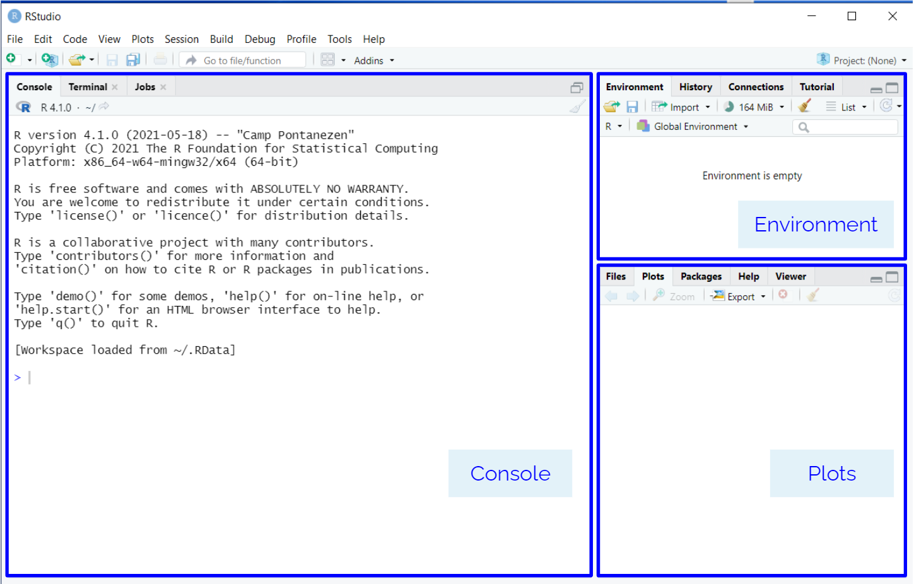
```


---

### Interactive Development Environment (IDE)

We are already familiar with JupyterLab


```{r rsjl, fig.align='center', echo = FALSE,out.width=900} 
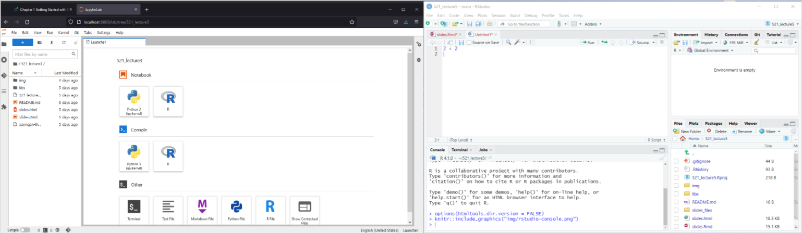
```


---

### Plots

If a plot is generate from the executed code, it will show up in the **Plots** tab in the bottom left panel. 


```{r obj4, fig.align='center', echo = TRUE, out.width=200} 
plot(cars)
```


.footnote[Note: it uses a built-in data set called `cars`]


---

### R Scripts

To create a new R Script, navigate to `New File -> R Script`. 


```R
x <- 5
y <- x + 3
print(paste0("y = ", y))
```
---

### Run the script


.pull-top[

```{r run, fig.align='center', echo = FALSE,out.width=500} 
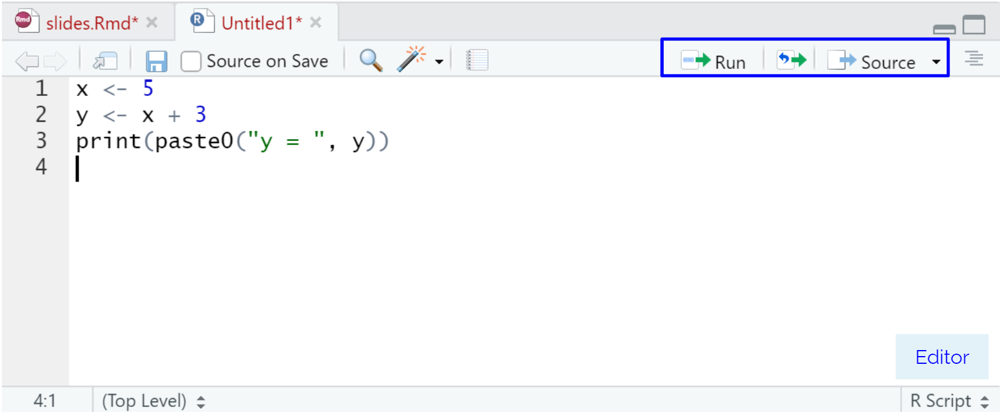
```


]

.pull-bottom[

- **Run** button to run just part of a script, which runs any highlighted lines.**Keyboard shortcut: ** `Ctrl + Enter`

- **Source** button to run the entire script 
 


]


---

## RStudio interface 

The editor is open now!

```{r rsconsole, fig.align='center', echo = FALSE,out.width=800} 
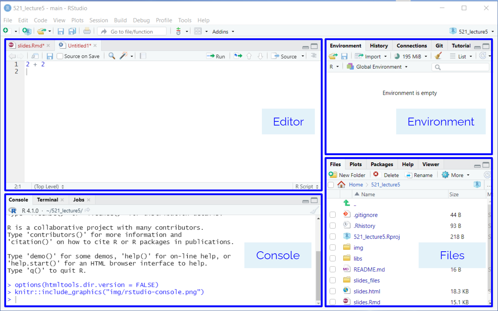
```


---

## RStudio interface
#### Tabs

.pull-left[

```{r rsconsole3, fig.align='center', echo = FALSE,out.width=500} 

```


]

.pull-right[


- **Editor**  is where you write R code that will be saved as a file.  
- **Console**  is where R commands are sent and evaluated by R. No R code written here is saved.  
- **Environment**  shows the currently defined variables.  
- **Files**  let's you navigate your file system. This panel also has the "Plots" and "Help" tabs which show figures you create and function documentation, respectively.


]
---

## RStudio interface 

```{r rs, fig.align='center', echo = FALSE,out.width=550} 
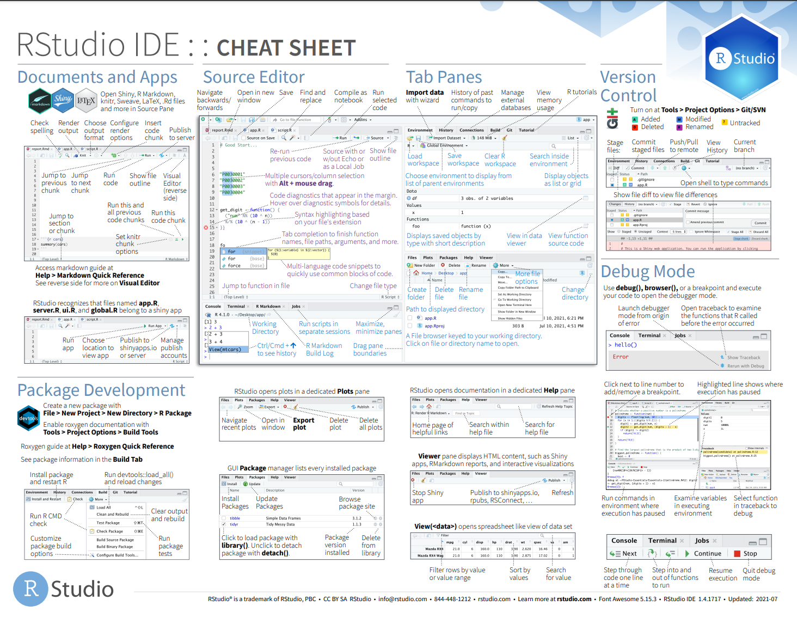
```


.footnote[[RStudio Cheat sheets](https://www.rstudio.com/resources/cheatsheets/)]

---


## Editing RStudio settings to not save workspace data


In general, we **NEVER** want to save our workspace (or load a previous one). 
We can avoid accidentally doing this through turning it off in the RStudio global options in the Tools menu.


```{r rdata, fig.align='center', echo = FALSE,out.width=300} 
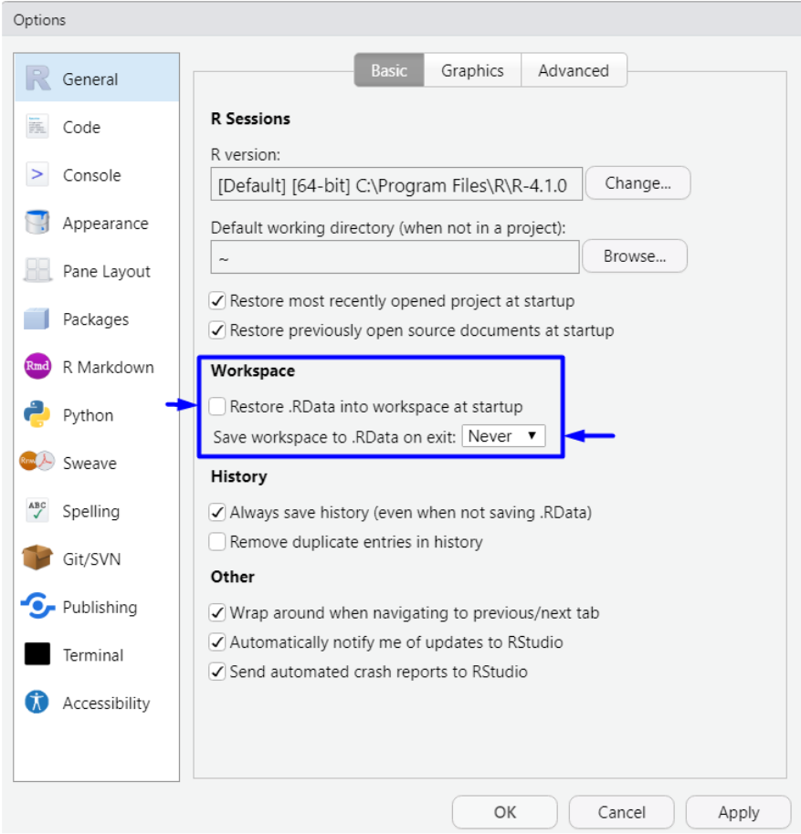
```

---

## Where we are? 🗺️

#### Different from JupyterLab
When you open RStudio the current working directory is not necessarily the project working directory.

--

.bg-washed-blue.b--dark-blue.ba.bw2.br3.shadow-5.ph4.mt5[

#### EVERY SESSION you need to tell RStudio where you are working
]

---

## Where we are? 🗺


You can find out one of two ways:

1. type `getwd()` in the console

2. In the files pane, 
  - click the cog/More button and then click **"Go To Working Directory"**


---

## Setting the working directory


1. Use an **RStudio project** 

--

2. In the _Files pane_
  - Navigate the file structure to where you want the working directory to be.
  - Then click the cog/More button and then click **Set As Working Directory**
  
--

3. In the _Session menu_, 
  - Click **Set Working Directory** 
  - Then **Choose Directory**

--

4. Type `setwd("PATH")` in the _Console_ 

--

.footnote[[🔥 Project oriented workflow 🔥 - Jenny Bryan](https://www.tidyverse.org/blog/2017/12/workflow-vs-script/)]

---


class: middle, center, inverse
 
# RStudio projects

---


class: middle

### An RStudio project is essentially a directory containing a special file: `*.Rproj`, which holds metadata for R about this project.


---

## Creating RStudio Projects


You can either create an empty RStudio project, or clone an existing GitHub repo, which also allows you to use the RStudio interface to control Git.

```{r pj, fig.align='center', echo = FALSE,out.width=300} 
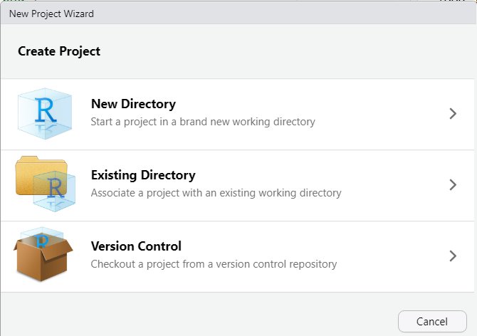
```
---

## RProjects set the working directory by default

We recommend using it together with the `here()` package, which can easily create paths relative to root project dir:

```{r eval=FALSE, include=TRUE}

install.packages("here")
library(here)

# If you data is in project_root/files/data/
# this will make sure that anyone using your project
# will get the correct path
 here("files", "data", "iris.csv")


```


---

class: middle, center, inverse

# R Markdown and   
# R Notebooks


---

## Notebooks

- You can interleave writing code, formatted narrative text, and view output all in the same document. 

- Notebooks are examples of what it is called **literate programming** where the goal is to mix code and paragraph text seamlessly.

#### Notebooks
Jupyter Notebooks ✔️  
  
 <span style="background-color:#00FF00">R Markdown Notebooks</span>

---

### R Markdown documents 

**R Markdown documents (.Rmd)** are most commonly run via R Notebooks which work similarly to Jupyter notebooks 
  
##### Let's see an example of this by creating a new R Notebook via `File -> New -> R Notebook`. 


```{r rmd, fig.align='left', echo = FALSE,out.width=100} 
knitr::include_graphics("img/rmarkdown.png")
```


.footnote[[What is the difference between a Notebook and an R Markdown file?](https://argoshare.is.ed.ac.uk/healthyr_book/what-is-the-difference-between-a-notebook-and-an-r-markdown-file.html)]

---

## R Markdown

We are going to learn with more detail the parts of an R Markdown file in lab3

```{r rnotebooks, fig.align='center', echo = FALSE,out.width=800} 
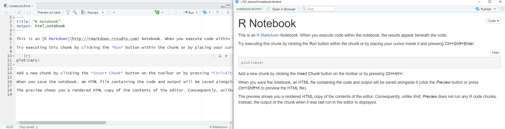
```


.footnote[[R Markdown](https://rmarkdown.rstudio.com/)]

---

### Text and rendering R Markdown documents


.pull-left[

**R Markdown only**
- Any line of text not in a code chunk will be formatted using Markdown. 
- To see this text rendered, you need to render the whole document

]

.pull-right[

**R Markdown and JupyterLab**

- You can use HTML and LaTeX here to do more advanced formatting. 

]


--

#### "Knit" or "Preview" button?
  - **Preview** creates a HTML version of your document as it looks right now
  - **Knit** first restarts the R session and runs through the entire document from the beginning to make sure it will work when you send it to someone else.


---

### A helpful hint 
#### for successfully working with R Markdown documents


##### - it is important to "knit" often as you make changes.


.footnote[This is similar to run "Run all cells" in Jupyter Notebooks]

---

## Jupyter Notebooks are stored in JSON format


.pull-left[

```{r json, fig.align='center', echo = FALSE,out.width=600} 
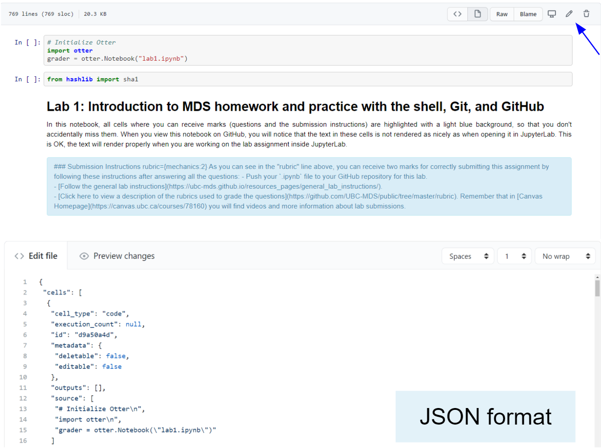
```
]

.pull-right[

- Difficult to edit as plain text
- Merge conflicts are more complicated to solve  

When you save a file in `.ipynb` format you are saving a .JSON too.

]
 
---

## JupyText

It is a plugin that can save **Jupyter notebooks** as either Markdown files or Scripts in many languages!

- Install JupyText
- Open the Command Palette and look for Paired Notebooks


.footnote[[JupyText](https://github.com/mwouts/jupytext)]

---

### Running, editing and creating code chunks

#### Code cells


.pull-left[

**R Markdown**
- Referred to as code "chunks" or "blocks" 
- To see this text rendered, you need to render the whole document

]

.pull-right[

**R Markdown and Jupyter Lab**

- You can use HTML and LaTeX here to do more advanced formatting. 

]

---

### Running, editing and creating code chunks


- R Markdown has code cells, although they're more commonly referred to as **code "chunks"** or "blocks". 

--

- Unique to R Markdown is that the leading three backticks are followed by curly braces containing the language engine you want to run.

--


```{r my first code chunk}
x <- 5

```  


---

### Running, editing and creating code chunks

- All code cells are run when you knit/render the entire document (like pressing "Run all" in JupyterLab). 

--

- By default, the code in the chunk and the code output will be included in your rendered document.

--

- You can also run the code by clicking the green play button on the right-hand side of the code chunk.

---

## Naming code chunks and R Markdown document sections

- When you include Markdown headers (using the # symbol) R Studio automatically creates a pop-up-like menu for you to use to navigate the document, which you can access by clicking the bar below this editor panel. It looks like:

```{r sect, fig.align='center', echo = FALSE,out.width=600} 
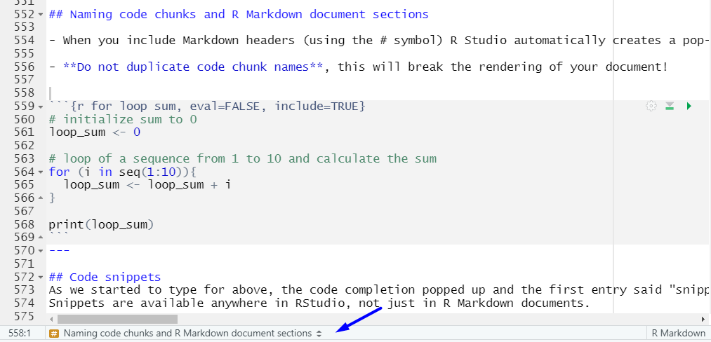
```

---

## Naming code chunks and R Markdown document sections


- **Do not duplicate code chunk names**, this will break the rendering of your document!


```{r for loop sum, eval=FALSE, include=TRUE}
# initialize sum to 0
loop_sum <- 0

# loop of a sequence from 1 to 10 and calculate the sum
for (i in seq(1:10)){
  loop_sum <- loop_sum + i
}

print(loop_sum)
```
---

## Code snippets
As we started to type for above, the code completion popped up and the first entry said "snippet", what is that? A code snippet is a text macro, which means that you can type a short string of characters to insert a template or snippet of text by pressing TAB. You can see all the default snippets and define your own by going to `Tools -> Global options -> Code -> Edit snippets`.
Snippets are available anywhere in RStudio, not just in R Markdown documents.


```{r spts, fig.align='left', echo = FALSE,out.width=300} 
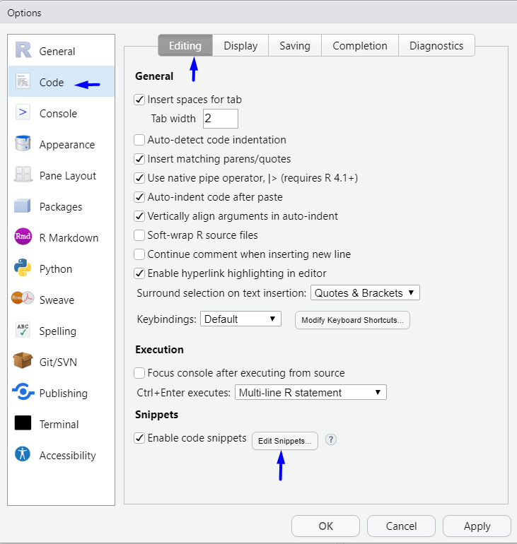
```
---

## Code snippets
```{r spts2, fig.align='left', echo = FALSE,out.width=600} 
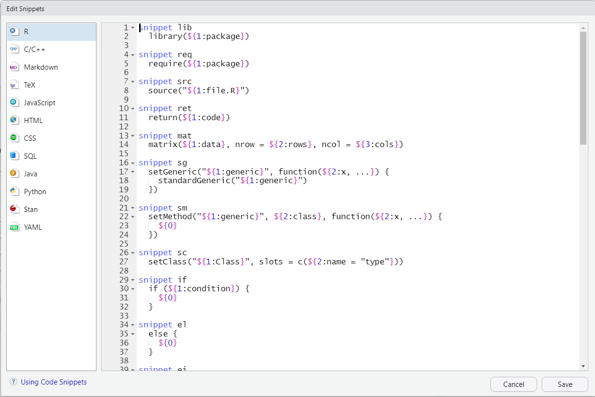
```


---

## Code chunk options
There are many code chunk options that you can set. These options let you customize chunk behavior, including whether a chunk is evaluated, whether to include the output in the rendered document, etc. A short list of code chunk options is shown below, but you can find an extensive list starting on the second page of this document.

You can set the chunk options at either a global level (once set they will be applied to all code chunks in the .Rmd file) or locally for a specific chunk (these will override the global chunk options if they are contradictory).

Global options are usually set in one chunk at the top of the document and looks like this (this is a screenshot):

```{r chunk, fig.align='left', echo = FALSE,out.width=500} 
knitr::include_graphics("img/chunk_options.png")
```

.footnote[[Chunk options and package options](https://yihui.org/knitr/options/)]

---


## Code chunk options


- **Global chunk options** are set by adding them as arguments to `knitr::opts_chunk$set(...)` (put them in place of ... and separate multiple options with a comma). The only global chunk options set in this document is `echo = FALSE`, which hides the code chunks and only shows the output, something that can be useful for non-technical reports.

--

- **Local chunk options** are set by adding the options in the curly braces of a code chunk after the language engine and code chunk name. For example, to not display warnings in a single code chunk we would use the `warning = FALSE` code chunk as follows:

--

```{r setup2, include=FALSE, echo = FALSE}
knitr::opts_chunk$set(echo = FALSE)
```

---

## A few tips and tricks

##### R Markdown support **inline evaluated code** via the following syntax
  - Adding 3 to 4 gives `r 4 + 3`.
  - The value of `x` is currently `r x`.  
  
--

##### Latex equations can be written the same way as in Jupyter notebooks and standard markdown documents.
- `$\alpha = 5$` for inline latex and `$$\alpha = 5$$` for a math block.
- When hovering over equations, R will display the rendered equation in a pop up.

---

## A few tips and tricks

##### R Markdown is built upon the **Pandoc** Markdown engine. 

- This is useful to know since the Pandoc manual is a great exhaustive resource for looking up anything Markdown related.

- One of the features made available thanks to Pandoc is support for **citations and bibliographies**.
  - Let's cite the R-package by typing `citation()` into the console, and copying the BibTex citation into a new document that we call `rstudio-demo.bib` 
and adding an identifier string (a key) before the first comma,
e.g.r-lang`.


.footnote[[Pandoc](https://pandoc.org/)]
---

## A few tips and tricks

Include the following field in the YAML metadata in the beginning of the document: bibliography: rstudio-demo.bib, then cite it somewhere in the text by adding [@r-lang]. The bibliography will be appended to the document, so it is advisable to add a heading saying # References at the very end.
When working with R Markdown (and code in general) be careful that you don't copy stylized quotation marks because these will not work. For example, this will throw an error:

a = **“**This string**”**
It should look like this instead:

a = **"**This string**"**


---

## References

.bg-washed-blue.b--dark-blue.ba.bw2.br3.shadow-5.ph4.mt5[

 [Elegant, flexible, and fast dynamic report generation with R](https://yihui.org/knitr/)

 [JupyText](https://github.com/mwouts/jupytext)

 [Pandoc](https://pandoc.org/)
 
 [R Markdown documents](https://rmarkdown.rstudio.com/)

 [R Markdown: The Definitive Guide](https://bookdown.org/yihui/rmarkdown/)


]

---

class: inverse, middle, center


## Thank you!


